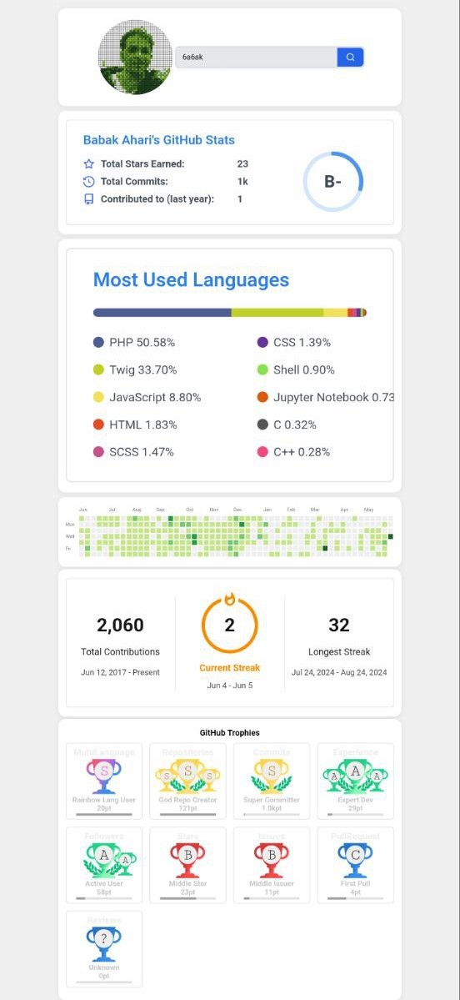

# GitHub Stats Viewer

A simple PHP web app to view GitHub user statistics and achievements in a clean, responsive dashboard.

## Features

- Search for any GitHub username
- View:
  - GitHub profile avatar
  - General stats (commits, PRs, etc.)
  - Top programming languages
  - Contribution chart
  - Streak stats
  - Trophy showcase

## Usage

1. Clone or download this repository.
2. Place the files on a PHP-enabled web server.
3. Open `index.php` in your browser.
4. Enter a GitHub username and view their stats!

## Example

## Credits

- [github-readme-stats](https://github.com/anuraghazra/github-readme-stats)
- [github-readme-streak-stats](https://github.com/DenverCoder1/github-readme-streak-stats)
- [github-profile-trophy](https://github.com/ryo-ma/github-profile-trophy)
- [ghchart](https://github.com/2016rshah/githubchart-api)

## License

MIT